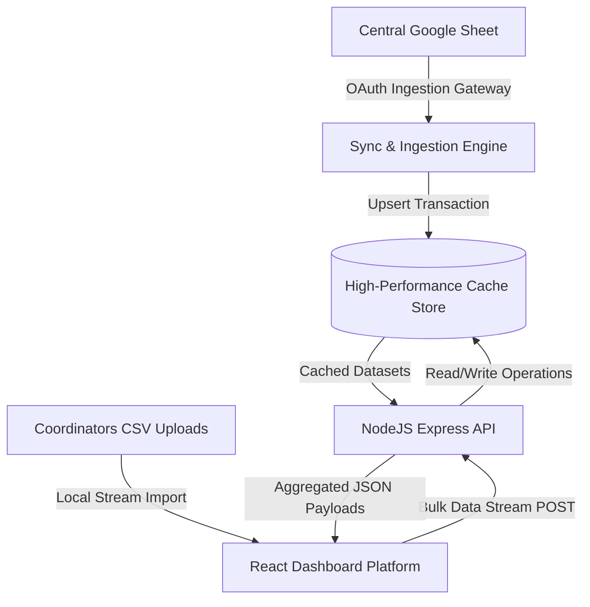

# TNP Placement & Internship Management Platform

An enterprise-grade, high-fidelity Placement and Internship Pipeline Tracking Platform designed to centralize, monitor, and automate student recruitment drives. Built on a modular architecture featuring live Google Workspace synchronization, high-performance database caching, and a premium glassmorphic analytics interface, the platform serves as a unified command center for placement cells, coordinators, and university networks.

---

## 🚀 Core Features

- **Automated Google Workspace Sync Gateway**: Live synchronization with central spreadsheets using the Google Sheets API v4, featuring automatic schema parsing, date-standardization, and error-tolerant tab auto-detection.
- **Unified Placement Dashboard**: High-fidelity UI tracking company status, upcoming timelines, active application links, and countdown timers.
- **Interview Preparation Bank**: A knowledge-base tracker linking past interview questions (DSA, OOP, System Design, HR) directly to company records.
- **Hybrid Ingestion Pipelines**: Multi-source data imports supporting direct Google Sheets OAuth streams, CSV file parses, and API integrations.
- **Cached In-Memory & Persistent Storage**: Resilient cache architecture using SQLite to serve fast, low-latency API queries while defending against external Google API quota throttling.

---

## 🏗️ Platform Architecture & Data Flow

The platform maintains a clear separation of concerns between its data ingestion workers and the client-facing presentation layers, maximizing uptime:

1. **Ingestion Layer**: Pulls candidate schedules and job postings from spreadsheet networks using Google API client libraries, mapping diverse datasets to a standardized schema.
2. **Persistence & Caching**: SQLite serves as a high-density, thread-safe derived-data cache, protecting the client application from downstream service outages or API rate limit bottlenecks.
3. **Application API**: Node.js + Express backend exposes optimized RESTful endpoints for companies, prep banks, logs, and synchronization metrics.
4. **Client Interface**: React-based dashboard showcasing application pipelines, preparation stats, and automated sync status logs.

---

## 🗄️ Core Database Schema

The database relies on a highly normalized relational schema designed for absolute data integrity:

### 1. `companies`
Stores job postings and application links synced from central spreadsheets or imported.
- `id` (INTEGER, Primary Key AUTOINCREMENT)
- `company_name` (TEXT, Not Null)
- `role` (TEXT, Not Null)
- `application_link` (TEXT)
- `deadline` (TEXT, Not Null) - Stored in ISO 8601 format
- `sheet_row_id` (TEXT, Unique) - Stable row identifier preventing duplicates during bulk ingestion
- `updated_at` (DATETIME)
- *Constraint*: `UNIQUE(company_name, role) ON CONFLICT REPLACE`

### 2. `experience_questions`
Maintains historical interview preparation patterns linked to companies.
- `id` (INTEGER, Primary Key AUTOINCREMENT)
- `company_id` (INTEGER, Foreign Key referencing `companies(id)` ON DELETE CASCADE)
- `question_text` (TEXT, Not Null)
- `category` (TEXT, Not Null) - (`DSA`, `OOP`, `System Design`, `HR`, `Resume`)
- `created_at` (DATETIME)

### 3. `sync_log`
Logs ingestion performance, row counts, and detailed error tracking.
- `id` (INTEGER, Primary Key AUTOINCREMENT)
- `timestamp` (DATETIME, Default current time)
- `status` (TEXT, `'SUCCESS'` / `'FAILURE'`)
- `rows_synced` (INTEGER, Default `0`)
- `error_message` (TEXT)

---

## 🛠️ Technology Stack

- **Frontend**: React (Vite), Vanilla CSS, Lucide Icons, PapaParse (CSV streaming engine)
- **Backend**: Node.js, Express, `better-sqlite3` (High-density SQL engine)
- **Data Ingestion**: Google APIs client library (`googleapis` v4)
