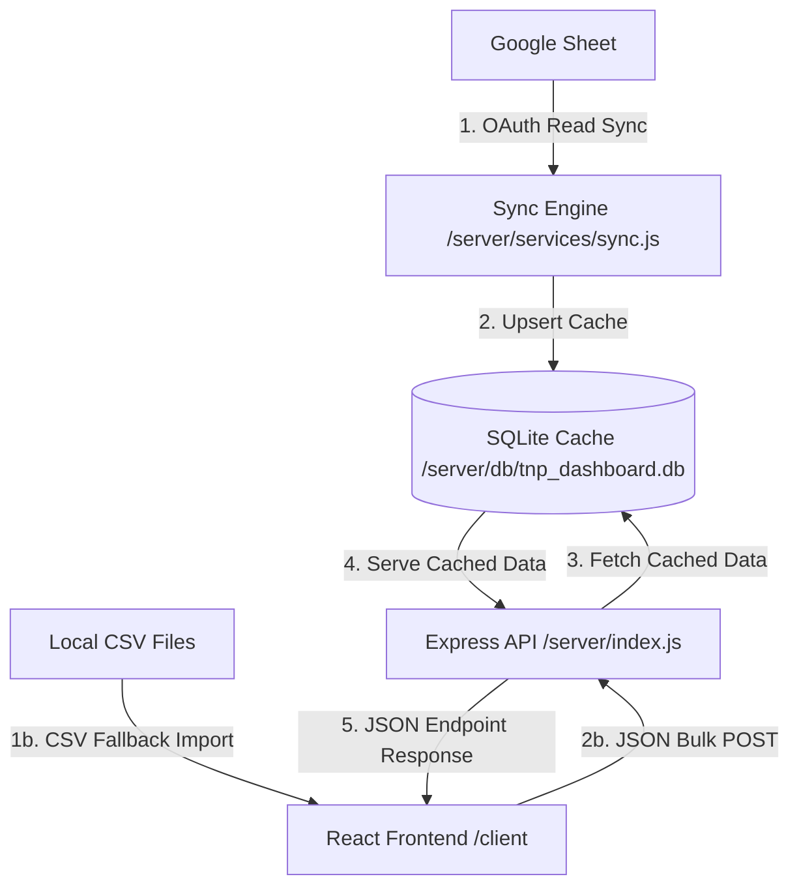

# TNP Dashboard

A premium, single-user personal placement and internship tracking dashboard designed to keep you organized during placement seasons. It displays job application deadlines and past interview questions by company with live synchronization from Google Sheets and a CSV fallback import.


---

## 🏗️ Architecture & Data Flow

This application is designed with a clear separation of concerns between the **sync/ingestion engine** and the **serving layer**, keeping it highly resilient and offline-capable:



1. **Google Sheets Sync**: The backend uses Google OAuth 2.0 with a read-only scope to pull rows from a target sheet. A sync service maps the columns, standardizes dates, and performs an atomic transaction to write them into SQLite.
2. **SQLite Cache**: Serves as a local derived-data cache. If Google Sheets API becomes rate-limited or offline, the app operates seamlessly on the last cached dataset.
3. **Express API**: Serves JSON endpoints for applications, questions, and sync logs, sorting deadlines intelligently (upcoming first, past deadlines descending).
4. **React Dashboard**: A high-fidelity glassmorphism dark-themed dashboard showing active countdowns, deadline warnings, prep breakdown metrics, and CSV fallback import workflows.

---

## 🛠️ Tech Stack

- **Frontend**: React (Vite), Vanilla CSS, Lucide Icons, PapaParse (client-side CSV parsing)
- **Backend**: Node.js, Express, `better-sqlite3` (fast, synchronous SQLite binding)
- **APIs & Auth**: Google APIs client library (`googleapis` OAuth 2.0 flow)

---

## 🗄️ Database Schema

The database consists of three tables defined in `server/db/schema.sql`:

### 1. `companies`
Stores job applications synced from Google Sheets or imported via CSV.
- `id` (INTEGER, Primary Key AUTOINCREMENT)
- `company_name` (TEXT, Not Null)
- `role` (TEXT, Not Null)
- `application_link` (TEXT)
- `deadline` (TEXT, Not Null) - Stored in ISO 8601 format
- `sheet_row_id` (TEXT, Unique) - Stable row identifier to prevent duplicates during syncs
- `updated_at` (DATETIME)
- *Constraint*: `UNIQUE(company_name, role) ON CONFLICT REPLACE` (Ensures updates to existing applications do not create duplicate rows)

### 2. `experience_questions`
Stores technical or behavioral interview questions categorized by topic.
- `id` (INTEGER, Primary Key AUTOINCREMENT)
- `company_id` (INTEGER, Foreign Key referencing `companies(id)` ON DELETE CASCADE)
- `question_text` (TEXT, Not Null)
- `category` (TEXT, Not Null) - (e.g. `DSA`, `OOP`, `System Design`, `HR`, `Resume`)
- `created_at` (DATETIME)

### 3. `sync_log`
Tracks every sync attempt for auditing and frontend status reporting.
- `id` (INTEGER, Primary Key AUTOINCREMENT)
- `timestamp` (DATETIME, Default current time)
- `status` (TEXT, e.g. `'SUCCESS'`, `'FAILURE'`)
- `rows_synced` (INTEGER, Default `0`)
- `error_message` (TEXT, Nullable error message)

---

## 🚀 Setup & Launch Instructions

### 1. Environmental Variables Configuration
Create a `.env` file in the root folder based on `.env.example`:
```bash
# Server Port
PORT=5000
CLIENT_URL=http://localhost:5173
DATABASE_PATH=./db/tnp_dashboard.db

# Google API Credentials (Optional: See Google Sheets Sync details below)
GOOGLE_CLIENT_ID=your-google-client-id
GOOGLE_CLIENT_SECRET=your-google-client-secret
GOOGLE_REDIRECT_URI=http://localhost:5000/api/auth/google/callback
GOOGLE_SHEET_ID=your-google-sheet-id
GOOGLE_SHEET_RANGE=Sheet1!A:D
```

### 2. Run the Express Backend
Install backend dependencies and boot up the development server:
```bash
cd server
npm install
npm run dev
```
*Note: On initial startup, the database is automatically created and seeded with mock placement data (Microsoft, Stripe, Google, Meta, Amazon, Apple, Netflix) and past interview questions to make the dashboard functional out-of-the-box.*

### 3. Run the React Frontend
Open a new terminal tab, install dependencies, and start Vite:
```bash
cd client
npm install
npm run dev
```
Visit `http://localhost:5173/` in your browser.

---

## 🔌 Google Sheets Sync Setup

To hook the dashboard up to a live Google Sheet:
1. Go to the [Google Cloud Console](https://console.cloud.google.com).
2. Create a project and enable the **Google Sheets API**.
3. Create an **OAuth 2.0 Client ID** (Application Type: *Web Application*).
4. Add `http://localhost:5000/api/auth/google/callback` to the **Authorized redirect URIs**.
5. Paste your client ID, client secret, and Sheet ID into the `.env` file in your project root.
6. Restart the backend.
7. Open the dashboard and click **Authorize Sheet**. Grant access using your personal Google account.
8. Once authorized, click **Sync Sheet** to pull live rows!

### Expected Google Sheet Format:
Your sheet should have a header row (which is skipped automatically) followed by columns:
- **Column A**: Company Name (e.g. `Google`)
- **Column B**: Role (e.g. `Software Engineer Intern`)
- **Column C**: Application Link (e.g. `https://careers.google.com`)
- **Column D**: Deadline (e.g. `2026-08-15` or `2026-08-15T18:00`)

---

## 📂 CSV Fallback Import Template

If Google Sheets API credentials are not set up, you can manually upload application data using the **Import Companies** and **Import Qs** modals on the dashboard.

### Companies CSV Template:
```csv
company_name,role,application_link,deadline
Stripe,Frontend Engineer Intern,https://stripe.com/jobs,2026-07-21T16:46
Google,Software Engineer Intern,https://careers.google.com,2026-07-24T16:46
```

### Questions CSV Template:
```csv
company_name,role,question_text,category
Microsoft,Software Engineering Intern,Implement a stack with push/pop in O(1) time.,DSA
Stripe,Frontend Engineer Intern,Explain standard HTTP caching headers.,OOP
```
*Note: If you import questions for a company that does not exist in the dashboard, the backend automatically creates a shell company record, preserving database relational integrity.*
