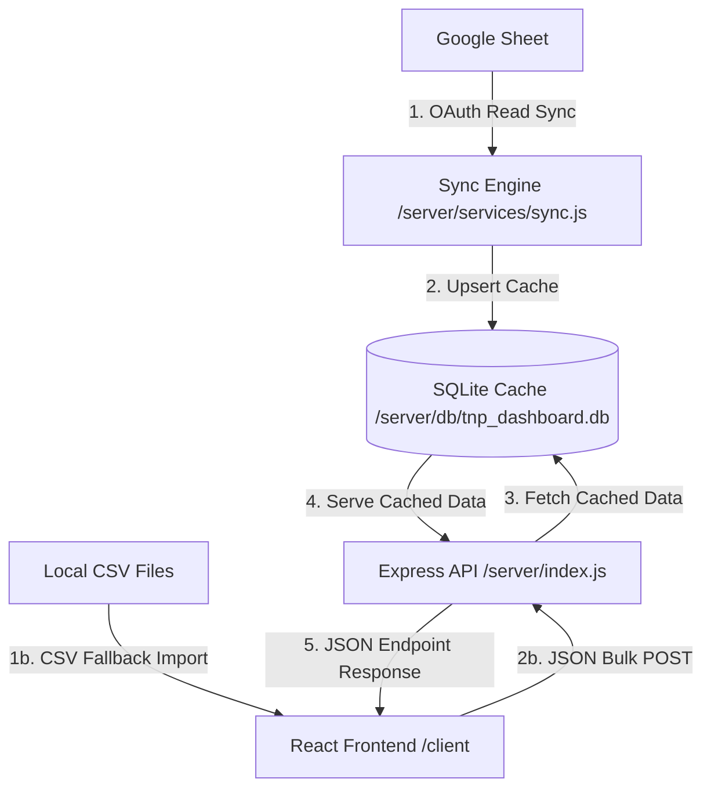

# TNP Dashboard - Technical Specifications

This document outlines the database schema, data flow, architecture, and technology stack of the TNP Dashboard project.

---

## 🏗️ Architecture & Data Flow

1. **Google Sheets Sync**: The backend uses Google OAuth 2.0 with a read-only scope to pull rows from a target sheet. A sync service maps the columns, standardizes dates, and performs an atomic transaction to write them into SQLite.
2. **SQLite Cache**: Serves as a local derived-data cache. If Google Sheets API becomes rate-limited or offline, the app operates seamlessly on the last cached dataset.
3. **Express API**: Serves JSON endpoints for applications, questions, and sync logs, sorting deadlines intelligently (upcoming first, past deadlines descending).
4. **React Dashboard**: A high-fidelity glassmorphism dark-themed dashboard showing active countdowns, deadline warnings, prep breakdown metrics, and CSV fallback import workflows.

---

## 🗄️ Database Schema

The database consists of three tables defined in `server/db/schema.sql`:

### 1. `companies`
Stores job applications synced from Google Sheets or imported via CSV.
- `id` (INTEGER, Primary Key AUTOINCREMENT)
- `company_name` (TEXT, Not Null)
- `role` (TEXT, Not Null)
- `application_link` (TEXT)
- `deadline` (TEXT, Not Null) - Stored in ISO 8601 format
- `sheet_row_id` (TEXT, Unique) - Stable row identifier to prevent duplicates during syncs
- `updated_at` (DATETIME)
- *Constraint*: `UNIQUE(company_name, role) ON CONFLICT REPLACE`

### 2. `experience_questions`
Stores technical or behavioral interview questions categorized by topic.
- `id` (INTEGER, Primary Key AUTOINCREMENT)
- `company_id` (INTEGER, Foreign Key referencing `companies(id)` ON DELETE CASCADE)
- `question_text` (TEXT, Not Null)
- `category` (TEXT, Not Null) - (e.g. `DSA`, `OOP`, `System Design`, `HR`, `Resume`)
- `created_at` (DATETIME)

### 3. `sync_log`
Tracks every sync attempt for auditing and frontend status reporting.
- `id` (INTEGER, Primary Key AUTOINCREMENT)
- `timestamp` (DATETIME, Default current time)
- `status` (TEXT, e.g. `'SUCCESS'`, `'FAILURE'`)
- `rows_synced` (INTEGER, Default `0`)
- `error_message` (TEXT, Nullable error message)

---

## 🛠️ Tech Stack

- **Frontend**: React (Vite), Vanilla CSS, Lucide Icons, PapaParse (client-side CSV parsing)
- **Backend**: Node.js, Express, `better-sqlite3` (fast, synchronous SQLite binding)
- **APIs & Auth**: Google APIs client library (`googleapis` OAuth 2.0 flow)
